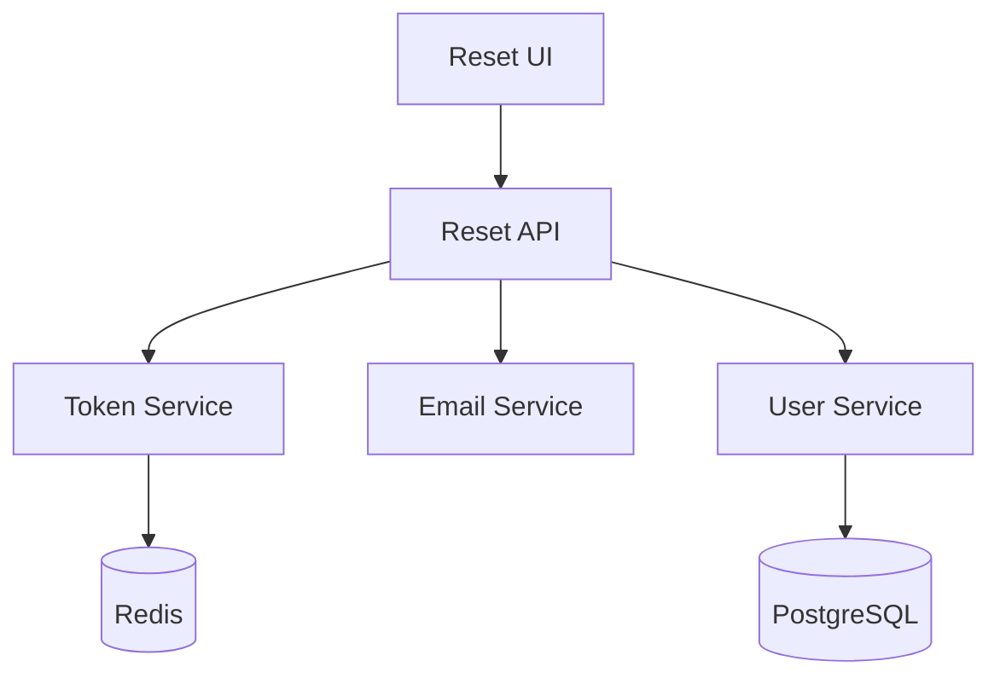
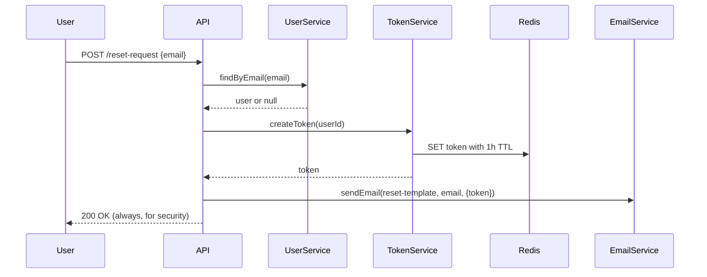

# Architecture Design Examples

## Example: Password Reset Feature

```markdown
# Architecture: Password Reset Flow

## Overview

A stateless token-based password reset system using existing email infrastructure and adding a new token storage mechanism.

## Component Diagram



## Components

### ResetController
- **Responsibility**: Handle HTTP requests for password reset flow
- **Location**: src/controllers/auth/reset.js
- **Dependencies**: TokenService, EmailService, UserService
- **Interface**: POST /reset-request, POST /reset-confirm

### TokenService
- **Responsibility**: Generate, store, and validate reset tokens
- **Location**: src/services/token.js
- **Dependencies**: Redis client
- **Interface**: createToken(userId), validateToken(token), invalidateToken(token)

### EmailService (existing)
- **Responsibility**: Send transactional emails
- **Location**: src/services/email.js
- **Dependencies**: SendGrid SDK
- **Interface**: sendEmail(template, recipient, data)

## Data Flow



## Boundaries

| Boundary | Type | Protocol |
|----------|------|----------|
| Reset API | REST API | HTTPS |
| Redis | Cache/Store | Redis protocol |
| PostgreSQL | Database | SQL |
| SendGrid | External | HTTPS |

## Patterns Used

- **Token-based auth**: Stateless verification via signed tokens
- **Rate limiting**: Existing middleware, configured per-route

## Trade-offs

| Decision | Alternatives Considered | Rationale |
|----------|------------------------|-----------|
| Redis for tokens | PostgreSQL table | Faster, auto-expiry with TTL, no migration needed |
| 1-hour expiry | 24 hours, 15 minutes | Balance security and usability |
| Same response always | Different for valid/invalid email | Prevent email enumeration attacks |

## Integration Points

- Uses existing UserService.findByEmail()
- Uses existing EmailService with new template
- Adds new routes to auth router

## Future Considerations

- Could add SMS reset option (new channel in TokenService)
- Could add reset attempt logging for security monitoring
```
